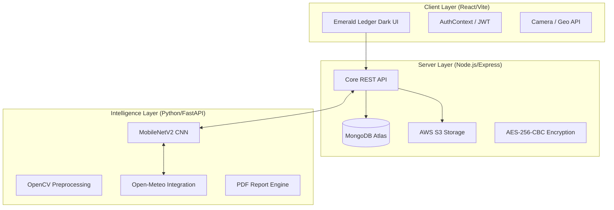

# CropHub: AI-Powered Agricultural Decision Support

CropHub is an integrated agricultural platform designed to bridge the gap between raw data and actionable agronomic insights. By fusing **Soil Computer Vision**, **Predictive Crop Allocation**, and **Market Arbitrage Intelligence**, CropHub empowers modern farmers to maximize yield and profit through data-driven decisions.

The platform utilizes a **"Emerald Ledger"** premium dark-themed aesthetic, focusing on high-contrast neon accents, deep forest-charcoal surfaces, and a responsive 3D-driven user experience.

---

## 🏗️ System Architecture

CropHub is engineered as a decoupled, multi-layer microservice architecture to ensure scalability and high-performance processing of ML tasks.

### 1. The Client Layer (`/client`)
Built with **React 18**, **Tailwind CSS**, and **Framer Motion**, the client handles all user interactions. It leverages browser APIs for GPS coordinates and high-resolution camera capture for soil samples.

### 2. The Server Layer (`/server`)
The "Brain" of the operation. Written in **Node.js**, it manages the high-level business logic, user profiles, and secure data storage.
- **Security**: Sensitive budget and land data are encrypted using `crypto` (AES-256-CBC) before being saved to MongoDB.
- **Storage**: User-uploaded soil images are stored in **AWS S3** with unique, signed identifiers.

### 3. The Intelligence Layer (`/terra_layer`)
The ML processing unit. A specialized Python service that takes soil images and location data to generate holistic health reports.
- **Classification**: Uses a fine-tuned **MobileNetV2** model to identify soil types (Alluvial, Black, Clay, Laterite, Red, Sandy).
- **Enrichment**: Fetches real-time weather data (Open-Meteo) and historic atmospheric patterns to provide tailored crop advice.

---

## 🚀 Deployment & Setup

To get the full system running, follow the specific setup guides for each layer:

1.  **[Client Deep-Dive](./client/README.md)**: UI/UX, Design System, and Animations.
2.  **[Server Deep-Dive](./server/README.md)**: REST API Specification, Database Schema, and Security.
3.  **[Terra Layer Deep-Dive](./terra_layer/README.md)**: Computer Vision Pipeline and ML Model Architecture.

---

## 🔒 Security & Privacy

CropHub is designed with a **Privacy-First** approach, ensuring that your farm data remains your proprietary asset:
- **AES-256-CBC Encryption**: All financial and land-size data passed to the Fathom Layer is encrypted using a unique `ENCRYPTION_KEY` and `ENCRYPTION_IV` before reaching the database.
- **JWT Authentication**: All requests across the entire ecosystem are secured via HMAC SHA256-signed JSON Web Tokens.
- **Signed Cloud Handles**: Direct access to AWS S3 buckets is prohibited; all media access is proxied through temporary, expiring pre-signed URLs.
- **Zero-Logging Policy**: Soil classification inputs are processed in-memory and only results are persisted, protecting raw field telemetry.

---

## 🛠️ Global Setup Workflow

To initialize the entire CropHub ecosystem locally, follow this sequence:

1.  **Configure Infrastructure**:
    - **Database**: Spin up a MongoDB instance (Local or Atlas).
    - **Storage**: Initialize an AWS S3 bucket for image ingestion.
2.  **Server Initialization**:
    - `cd server && npm install`
    - Configure `.env` with DB and S3 credentials.
    - `npm run dev` to start the Node.js orchestrator.
3.  **Intelligence Layer Setup**:
    - `cd terra_layer`
    - Initialize Python 3.10+ venv and install `requirements.txt`.
    - Place `model.h5` in the root (see [Drive Link](./terra_layer/README.md)).
    - `uvicorn main:app --port 8000` to start the analysis engine.
4.  **Client Launch**:
    - `cd client && npm install`
    - `npm run dev` to launch the Emerald Ledger UI.

---

## 📄 Documentation Manifest

- **[Master System Guide](README.md)**: High-level architecture and philosophy.
- **[Client Documentation](./client/README.md)**: Design system, components, and state management.
- **[Server Documentation](./server/README.md)**: API endpoints, encryption logic, and database schemas.
- **[Terra Layer Documentation](./terra_layer/README.md)**: ML models, OpenCV pipeline, and data synthesis.
